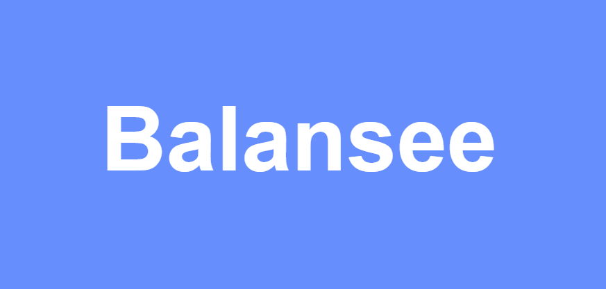

# BalanSee: 시각 장애인용 AI 웹도우미

## 1\. 개요

**BalanSee**는 웹상의 시각 정보를 모든 사용자가 동등하게 접근할 수 있도록 돕는 브라우저 확장 프로그램입니다. AI 기술을 활용하여 대체 텍스트(Alt Text)가 없는 이미지에 자동으로 문맥에 맞는 설명을 생성하고, 웹페이지 전체의 구조와 내용을 요약하여 시각장애인 및 저시력자 사용자의 웹 브라우징 경험을 개선합니다.

## 2\. 제공하는 기능

  * **🤖 AI 대체 텍스트 생성**: 페이지 내에 대체 텍스트가 없거나 비어있는 이미지를 자동으로 탐지하여, AI가 페이지의 전체 문맥(HTML 구조, 텍스트 내용, 페이지 스크린샷)을 종합적으로 분석한 뒤 가장 적절한 설명을 실시간으로 생성하여 적용합니다.
  * **📄 페이지 요약**: 페이지 전체의 레이아웃과 콘텐츠를 기반으로, AI가 현재 페이지의 목적과 핵심 내용을 요약하여 제공합니다.
  * **🔊 TTS(Text-to-Speech) 연동**: 생성된 대체 텍스트와 페이지 요약 내용을 음성으로 변환하여 사용자에게 들려주는 기능을 제공합니다.

## 3\. 시연 영상

*(이곳에 프로젝트의 핵심 기능을 보여주는 GIF 파일이나 유튜브 영상 링크를 삽입하세요.)*

**예시:**

> 위 이미지를 클릭하면 시연 영상을 확인할 수 있습니다.

## 4\. Usage

### Client

    1. Clone 'client' repository
    2. Enter chrome://extensions
    3. Enable Developer Mode
    4. Load extracted extension

### Server

    
    cd backend
    uvicorn main:app --reload

## 5\. TEAM

  
<table>
    <thead>
        <tr>
            <th colspan="5"> Balansee </th>
        </tr>
    </thead>
    <tbody>
         <tr>
           <td align='center'><a href="https://github.com/3004yechan" target='_blank'></td>
           <td align='center'><a href="https://github.com/chaelyn-kim" target='_blank'></td>
           <td align='center'><a href="https://github.com/showtime3763" target='_blank'></td>
           <td align='center'><a href="https://github.com/gksgpals" target='_blank'></td>
         </tr>
         <tr>
           <td align='center'>차예찬</td>
           <td align='center'>김채린</td>
           <td align='center'>이지형</td>
           <td align='center'>한혜민</td>
         </tr>
         <tr>
           <td align='center'>🎨</td>
           <td align='center'>🎨</td>
           <td align='center'>⚙️</td>
           <td align='center'>💾</td>
         </tr>
         <tr>
           <td align='center'>Front-End</td>
           <td align='center'>Front-end</td>
           <td align='center'>Backend</td>
           <td align='center'>Database</td>
         </tr>
    </tbody>
</table>

 
